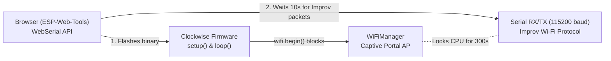

# Clockwise: ESP-Web-Tools & Improv Wi-Fi Bug Analysis

**Date**: 2026-10-04  
**Project**: [Clockwise](https://github.com/jnthas/clockwise)  
**Scope**: Bug diagnosis & root cause analysis (firmware boot flow, WebSerial/Improv protocol, manifest matching)

---

## 1. Bug Description & Observed Behavior

When installing Clockwise firmware through [clockwise.page](https://clockwise.page) using **ESP-Web-Tools**:

* **Expected Flow**:
  1. WebSerial flashes the firmware binaries.
  2. Dialog confirms: *"Installation complete!"* -> user clicks **NEXT**.
  3. **Step 5 ("Configure Wi-Fi")** appears: the browser lists scanned 2.4 GHz SSIDs, prompts for a password, provisions the device over serial, and shows a **VISIT DEVICE** link to the local web server.

* **Actual (Buggy) Flow**:
  1. WebSerial completes flashing.
  2. Instead of showing the Wi-Fi configuration screen, the dialog drops back to displaying only two options:
     * **`INSTALL CLOCKWISE`**
     * **`LOGS & CONSOLE`**
  3. Simultaneously on the physical Clockwise unit:
     * The 64×64 LED matrix displays: `"Setup WiFi via AP"`.
     * The ESP32 starts broadcasting a standalone Access Point named `"Clockwise-Wifi"` (captive portal) instead of completing serial setup.

---

## 2. Technical Architecture & Component Interaction

To identify the root cause, three interdependent layers must be analyzed:



1. **ESP-Web-Tools ([`esp-web-tools`](https://github.com/esphome/esp-web-tools))**:
   * Uses WebSerial over HTTPS.
   * After flashing or upon connecting, it sends Improv RPC commands (`GET_CURRENT_STATE` [0x02], `GET_DEVICE_INFO` [0x03]).
   * By default, it imposes a **10-second timeout** (`new_install_improv_wait_time`) for the device to announce its boot state.
   * Compares the reported device firmware name against `manifest.json` (`checkSameFirmware`). If it detects no response or a mismatch, it treats the device as unprovisioned/foreign and shows only `INSTALL` and `LOGS & CONSOLE`.

2. **Improv Wi-Fi Serial ([`ImprovWiFiLibrary`](firmware/lib/cw-commons/WiFiController.h))**:
   * Packet-based RPC protocol running over hardware UART (`Serial`).
   * Requires continuous polling via `improvSerial.handleSerial()` to read incoming bytes from the UART buffer, parse commands, and send replies.

3. **Clockwise System Lifecycle ([`main.cpp`](firmware/src/main.cpp) & [`WiFiController.h`](firmware/lib/cw-commons/WiFiController.h))**:
   * `setup()` loads settings, initializes the HUB75 DMA matrix display, and calls `wifi.begin()`.
   * `loop()` services `wifi.handleImprovWiFi()`, HTTP server requests, NTP events, and clockface rendering.

---

## 3. Root Cause Analysis

### Root Cause 1: Execution Deadlock in `setup()` Starves Improv Serial

#### The Code Path
In [`firmware/src/main.cpp`](firmware/src/main.cpp):
```cpp
void setup()
{
  ...
  StatusController::getInstance()->wifiConnecting();
  if (wifi.begin()) // <--- Invokes WiFiController::begin()
  {
    ...
  }
}

void loop()
{
  wifi.handleImprovWiFi(); // <--- Improv Serial is only serviced HERE!
  ...
}
```

In [`firmware/lib/cw-commons/WiFiController.h`](firmware/lib/cw-commons/WiFiController.h):
```cpp
bool begin()
{
  WiFi.mode(WIFI_STA);
  WiFi.disconnect();

  improvSerial.setDeviceInfo(ImprovTypes::ChipFamily::CF_ESP32, CW_FW_NAME, CW_FW_VERSION, "Clockwise");
  ...
  ClockwiseParams::getInstance()->load();

  if (!ClockwiseParams::getInstance()->wifiSsid.isEmpty())
  {
    // Try connecting to stored credentials...
  }

  // Fallback executed when wifiSsid is empty:
  StatusController::getInstance()->wifiConnectionFailed("Setup WiFi via AP");
  alternativeSetupMethod(); // <--- BLOCKING CALL!

  StatusController::getInstance()->wifiConnectionFailed("WiFi Failed");
  return false;
}
```

In `alternativeSetupMethod()`:
```cpp
bool alternativeSetupMethod()
{
  WiFiManager wifiManager;
  wifiManager.setConfigPortalTimeout(300); // 5-minute timeout

  bool success = wifiManager.startConfigPortal("Clockwise-Wifi"); // BLOCKS CPU
  ...
}
```

#### Why it Breaks
1. **Fresh Installation State**: On a freshly flashed ESP32 (or after an erase), NVS preferences are clean. `ClockwiseParams::getInstance()->wifiSsid.isEmpty()` is **true**.
2. **Immediate Blocking Execution**: `wifi.begin()` immediately calls `alternativeSetupMethod()`.
3. **5-Minute Captive Loop**: `WiFiManager::startConfigPortal()` starts SoftAP `"Clockwise-Wifi"` and enters a blocking internal loop for up to **300 seconds** (5 minutes).
4. **Starvation**: Because execution is trapped inside `startConfigPortal()` within `setup()`, **`loop()` is never reached**. As a result, `wifi.handleImprovWiFi()` is never called.
5. **Browser Timeout**: While the ESP32 is locked in `startConfigPortal()`, ESP-Web-Tools sends WebSerial RPC probes. Since `handleSerial()` is never polled, incoming bytes sit unread in the UART buffer. After 10 seconds without a response, ESP-Web-Tools gives up, assumes Improv is unsupported, and presents the fallback menu (`INSTALL CLOCKWISE` / `LOGS & CONSOLE`).
6. **Hardware State**: Meanwhile, the LED matrix displays `"Setup WiFi via AP"` as commanded by line 98 of `WiFiController.h`.

#### Origin in Git History
* **Commit `bf597ec`** (*"Improv must be used first before WifiMan"*):
  `alternativeSetupMethod()` was originally nested inside `if (!ClockwiseParams::getInstance()->wifiSsid.isEmpty())`. If `wifiSsid` was empty, `wifi.begin()` returned immediately, `setup()` finished, and `loop()` immediately serviced `handleImprovWiFi()`.
* **Commit `33013df`** (*"Fix for not starting AP if SSID empty (e.g. flashing from platformio to new esp32)"*):
  To support developers flashing via PlatformIO (who don't use WebSerial), a contributor moved `alternativeSetupMethod()` outside the `if` block so empty credentials would launch the AP. This unintentionally introduced a 300-second blocking call right on boot for every clean install, breaking the web installer.

---

### Root Cause 2: Firmware Name Mismatch Between Device & `manifest.json`

Even if the serial handler were active, a secondary protocol barrier exists in firmware identification.

According to the [ESP-Web-Tools documentation](https://esphome.github.io/esp-web-tools/):
> *"ESP Web Tools offers users a new installation if it is unable to detect the current firmware of the device (via Improv Serial) or if the detected firmware does not match the name specified in the manifest."*

1. **Manifest Configuration**:
   In `static/firmware/<clockface>/manifest.json` on the `gh-pages` branch, releases define the build name dynamically generated during GitHub Actions CI:
   ```json
   {
       "name": "CW_20261004",
       "builds": [ ... ]
   }
   ```
2. **Firmware Identity in Code**:
   In [`firmware/platformio.ini`](firmware/platformio.ini):
   ```ini
   -D CW_FW_NAME="\"${sysenv.FW_NAME}\""
   ```
   In [`WiFiController.h`](firmware/lib/cw-commons/WiFiController.h):
   ```cpp
   improvSerial.setDeviceInfo(ImprovTypes::ChipFamily::CF_ESP32, CW_FW_NAME, CW_FW_VERSION, "Clockwise");
   ```
3. **Mismatch**:
   When built locally without `FW_NAME` explicitly exported, `CW_FW_NAME` evaluates to `""` (empty string). When ESP-Web-Tools sends `GET_DEVICE_INFO` and receives an empty or differing firmware name, `checkSameFirmware` fails. ESP-Web-Tools treats the device as not having Clockwise installed and defaults to the install screen.

---

### Root Cause 3: Stored Bad Credentials Bypassing Serial Setup

In [`WiFiController.h`](firmware/lib/cw-commons/WiFiController.h):
* If a board was previously configured with Wi-Fi credentials that are no longer valid (e.g., changed router password, moved location) and was reflashed without checking "Erase all data":
* `improvSerial.tryConnectToWifi(...)` runs for ~10 seconds (20 retries × 500 ms) and fails.
* Upon failure, the original code did not provide any opportunity to reconfigure via Improv Serial; it immediately dropped into the blocking `alternativeSetupMethod()` (AP mode).

---

## 4. Summary Matrix

| Failure Mode | Direct Mechanism | Symptom in Browser | Symptom on Matrix Display |
| :--- | :--- | :--- | :--- |
| **`setup()` Blockade** | `wifiManager.startConfigPortal()` blocks CPU for 300s inside `setup()`. | ESP-Web-Tools hits 10s timeout; drops to `INSTALL` / `LOGS`. | Shows `"Setup WiFi via AP"`. |
| **Name Mismatch** | `CW_FW_NAME` (`""` or build-tag) ≠ `manifest.json` `name`. | Rejects device identity; refuses to show `CHANGE WI-FI` / `VISIT DEVICE`. | Matrix may show clockface, but browser won't manage it. |
| **Stale Credentials** | Stored NVS credentials fail to associate; falls through to AP portal. | WebSerial is ignored; device enters AP mode. | Shows `"Setup WiFi via AP"`. |

---

## 5. Architectural Considerations for the Next Iteration

When designing the solution in the next iteration, the following trade-offs and architectural options should be considered:

1. **Execution Model for Improv vs. AP Fallback**:
   * *Option A (Serial Grace Period)*: Give Improv Serial a bounded listening window on boot before transitioning to AP mode.
   * *Option B (FreeRTOS Background Task)*: Run `improvSerial.handleSerial()` on a dedicated FreeRTOS task (Core 0), ensuring serial frames are serviced concurrently regardless of whether `WiFiManager`, NTP sync, or rendering is executing on the main thread.
   * *Option C (Non-blocking WiFiManager)*: Switch `WiFiManager` to non-blocking mode (`setConfigPortalBlocking(false)`) and cooperatively pump both `handleSerial()` and `wifiManager.process()` inside `loop()`.

2. **Firmware Identity Harmonization**:
   * Ensure `CW_FW_NAME` has a stable fallback in `platformio.ini` that aligns with the manifest structure or website `checkSameFirmware` overrides.

3. **Developer vs. End-User Workflow**:
   * Ensure the chosen approach cleanly supports both WebSerial browser users (primary audience) and headless PlatformIO command-line developers without manual reconfiguration.
