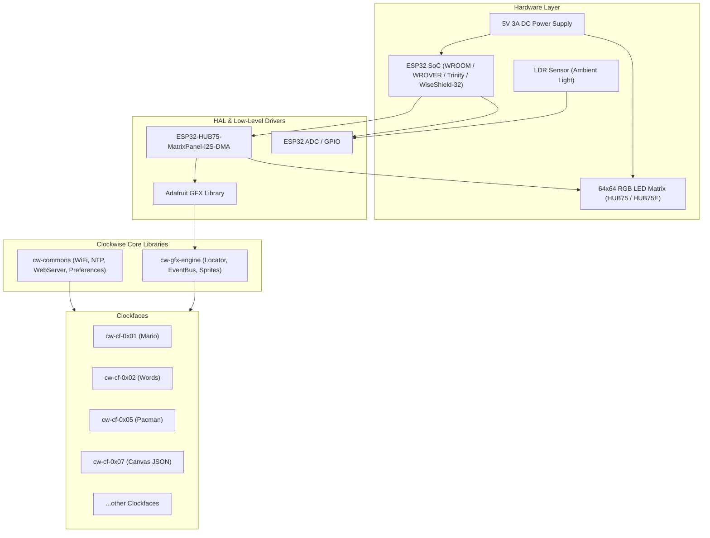
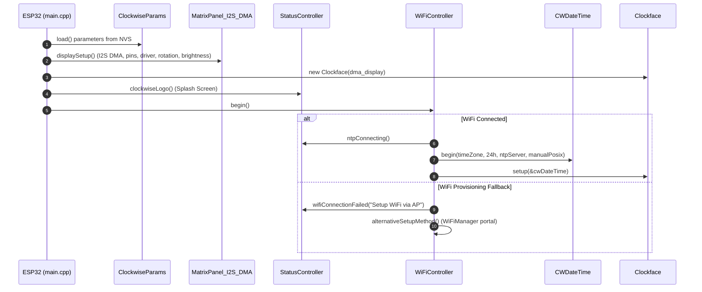

# Clockwise Firmware Architecture & Technical Overview

This document provides a comprehensive technical overview of the **Clockwise** firmware architecture, hardware integration, component design, execution lifecycle, and maintenance practices.

---

## 1. System & Hardware Architecture

Clockwise is built on top of the **Espressif ESP32** SoC and drives a **64×64 RGB LED Matrix** using hardware-accelerated DMA.



### Hardware Specifications
* **Microcontroller**: Dual-core ESP32 @ 240MHz with 520 KB SRAM and 4MB+ Flash.
* **Display Interface**: HUB75 / HUB75E protocol clocked via ESP32 I2S DMA peripheral at configurable speeds (8 MHz, 16 MHz, or 20 MHz).
* **Display Addressing**: 1:32 scan rate (with E-line support on pin 18 for HUB75E 64×64 panels).
* **Sensors**: Ambient light detection via a photoresistor (LDR) on ADC1 (default: GPIO 35).
* **Power Supply**: 5V DC rated for at least 3A (current consumption peaks with full-white high brightness).

---

## 2. Layered Software Architecture

The software architecture is separated into distinct abstraction layers:

```
┌─────────────────────────────────────────────────────────────┐
│                 Clockfaces (Themes / Skins)                 │
│  cw-cf-0x01 (Mario) | cw-cf-0x02 (Words) | cw-cf-0x07 (Canvas) │
├──────────────────────────────┬──────────────────────────────┤
│   cw-commons (System Layer)  │  cw-gfx-engine (2D Graphics) │
│ - ClockwiseParams (NVS)      │ - Locator (Service Locator)  │
│ - WiFiController (Improv/AP) │ - EventBus (Pub/Sub)         │
│ - CWDateTime (NTP/ezTime)    │ - Sprite / Tile / Object     │
│ - ClockwiseWebServer         │ - Color & Image Utilities    │
│ - StatusController           │                              │
├──────────────────────────────┴──────────────────────────────┤
│                Drivers & External Components                │
│ - ESP32-HUB75-MatrixPanel-I2S-DMA                           │
│ - Adafruit-GFX-Library & PNGdec                              │
│ - Arduino-ESP32 Core & FreeRTOS                              │
└─────────────────────────────────────────────────────────────┘
```

---

## 3. Core Subsystems & Components

### 3.1 Preferences & Persistence (`ClockwiseParams`)
* **Location**: `firmware/lib/cw-commons/CWPreferences.h`
* **Pattern**: Singleton.
* **Backing Store**: ESP32 Non-Volatile Storage (NVS) via the `Preferences` library under the namespace `"clockwise"`.
* **Stored Parameters**:
  * Network: `wifiSsid`, `wifiPwd`, `ntpServer` (default `time.google.com`).
  * Time: `timeZone` (Olson format, default `America/Sao_Paulo`), `use24hFormat`, `manualPosix` (POSIX timezone string for offline/custom rules).
  * Display: `displayBright` (0-255), `displayRotation` (0, 90, 180, 270), `swapBlueGreen`, `swapBlueRed`, `driver`, `i2cSpeed`, `E_pin`.
  * Automatic Brightness: `autoBrightMin`, `autoBrightMax`, `ldrPin` (default GPIO 35).
  * Canvas: `canvasServer`, `canvasFile`.

### 3.2 Connectivity & Provisioning (`WiFiController`)
* **Location**: `firmware/lib/cw-commons/WiFiController.h`
* **Multi-stage Provisioning**:
  1. **Web Serial / Improv WiFi**: Listens over `Serial` (115200 baud) using `ImprovWiFiLibrary`. Enables web-based flashing and WiFi provisioning directly from Chrome/Edge on `clockwise.page`.
  2. **Saved Credentials**: Attempts auto-connect to the stored SSID and password in NVS.
  3. **Fallback Captive Portal**: If saved credentials fail or are absent, starts `WiFiManager` with an Access Point named `Clockwise-Wifi` (timeout: 5 minutes).
  4. **mDNS**: Registers the hostname `clockwise.local` on port 80 for zero-configuration access on local networks.
  5. **Watchdog**: If offline without a clockface for more than 5 minutes, forces a software restart (`ESP.restart()`).

### 3.3 Time Management (`CWDateTime`)
* **Location**: `firmware/lib/cw-commons/CWDateTime.h` / `CWDateTime.cpp`
* **Dependency**: Wraps `ezTime` (`ropg/ezTime`).
* **Features**:
  * Syncs against NTP asynchronously.
  * Supports geographical timezone strings (e.g., `Europe/London`, `America/New_York`) synced via ezTime timezone lookup.
  * Supports manual POSIX timezone strings (e.g., `EST5EDT,M3.2.0/2,M11.1.0/2`) to operate independently without relying on external timezone lookup servers.
  * Formatted output (`getFormattedTime()`, `getHour()`, `getMinute()`, AM/PM detection, etc.).

### 3.4 Web Configuration Server (`ClockwiseWebServer`)
* **Location**: `firmware/lib/cw-commons/CWWebServer.h`
* **Server**: Raw `WiFiServer` listening on TCP port 80.
* **Endpoints**:
  * `GET /`: Serves the embedded HTML/CSS/JS Single Page Application defined in `SettingsWebPage.h`.
  * `GET /get`: Returns HTTP 204 with current configuration options sent as custom `X-<Setting>: <Value>` HTTP response headers.
  * `POST /set?<param>=<value>`: Updates one or more settings in `ClockwiseParams` and commits to NVS.
  * `GET /read?pin=<pin>`: Samples an analog pin and returns its current reading (used by the web UI to test and calibrate LDR sensitivity).
  * `POST /restart`: Returns HTTP 204 and flags the main loop to perform `ESP.restart()`.

### 3.5 Graphics Engine (`cw-gfx-engine`)
* **Location**: `firmware/lib/cw-gfx-engine/`
* **Patterns & Features**:
  * **Service Locator (`Locator`)**: Provides decoupled global access to `Adafruit_GFX*` and `EventBus*`.
  * **Publish/Subscribe (`EventBus`)**: Enables decoupled event broadcasting between sprites and animations.
  * **2D Primitives (`Sprite`, `Tile`, `Object`)**: Provides coordinate tracking, bounding box collision detection (`collidedWith()`), and tile-based rendering.

### 3.6 Clockface Interface & Canvas Clockface
* **Interface**: All clockfaces implement `IClockface` (`setup(CWDateTime*)` and `update()`).
* **C++ Clockfaces**: Custom themes (like Mario Bros, Castlevania, Pacman) implement high-performance game loops and animations in C++.
* **Canvas Clockface (`cw-cf-0x07`)**:
  * A runtime JSON interpreter that turns the display into a programmable canvas without requiring recompilation.
  * Downloads a theme JSON file via HTTP (`CWHttpClient`).
  * Parses drawing directives: `datetime` (formatted text), `line`, `rect`, `fillrect`, `text`, and base64-encoded PNG `image` elements (decoded via `PNGdec`).
  * Supports looping sprite animations and frame intervals.

---

## 4. Execution Lifecycle

### 4.1 Boot Sequence (`setup()`)



### 4.2 Main Loop (`loop()`)

During normal operation, `loop()` executes continuously:

1. **`wifi.handleImprovWiFi()`**: Processes any serial commands sent via the browser USB flasher.
2. **`ClockwiseWebServer::handleHttpRequest()`**: Serves web configuration requests when connected.
3. **`ezt::events()`**: ezTime background handler that maintains NTP synchronization and handles timezone changes.
4. **`clockface->update()`**: Invokes active clockface logic, sprite movements, and redraw routines.
5. **`automaticBrightControl()`**: Runs every 3000 ms:
   * Reads ADC value on `ldrPin`.
   * Maps reading across `[autoBrightMin, autoBrightMax]` into discrete slots.
   * Adjusts DMA display brightness if light changes by 2 or more slots.

---

## 5. Build Systems & CI/CD

Clockwise supports two distinct development workflows and an automated release pipeline:

### 5.1 PlatformIO (Recommended for App Developers)
* **Configuration**: `firmware/platformio.ini`
* **Target Board**: `board = esp32doit-devkit-v1`, `framework = arduino`
* **Clockface Selection**: The active clockface is selected by symlinking or copying the clockface submodule into `firmware/lib/`:
  ```bash
  cd firmware/lib
  ln -s ../clockfaces/cw-cf-0x01/ mario
  pio run
  ```

### 5.2 ESP-IDF (For Native Espressif Control)
* **Configuration**: `CMakeLists.txt`, `main/CMakeLists.txt`, `main/Kconfig.projbuild`
* **Target Build**:
  ```bash
  idf.py menuconfig   # Select "Clockwise Configuration" -> pick Clockface
  idf.py build
  idf.py -p /dev/ttyUSB0 flash monitor
  ```

### 5.3 Automated CI/CD (`.github/workflows/clockwise-ci.yml`)
* Triggers on branch push `releases/**` or via manual dispatch.
* Uses a GitHub Actions build matrix covering each clockface (`cw-cf-0x01` through `cw-cf-0x07`).
* Automatically compiles binaries and updates `manifest.json` on the `gh-pages` branch, making new builds available on [clockwise.page](https://clockwise.page).

---

## 6. Maintainer & Extension Guidelines

### Adding a New Configuration Parameter
1. Add property definition and NVS key constant in `firmware/lib/cw-commons/CWPreferences.h`.
2. Add default value in `ClockwiseParams::load()` and serializer in `ClockwiseParams::save()`.
3. Add GET/POST handling in `firmware/lib/cw-commons/CWWebServer.h` (`getCurrentSettings()` and `processRequest()`).
4. Update UI input card in `firmware/lib/cw-commons/SettingsWebPage.h`.

### Creating a New Clockface
1. Fork the template repository: `https://github.com/jnthas/cw-cf-0x00`.
2. Implement the `IClockface` interface (`setup()` and `update()`).
3. Add submodule to `.gitmodules` and `firmware/clockfaces/`.
4. Register the new clockface in `main/CMakeLists.txt`, `main/Kconfig.projbuild`, and `.github/workflows/clockwise-ci.yml`.
