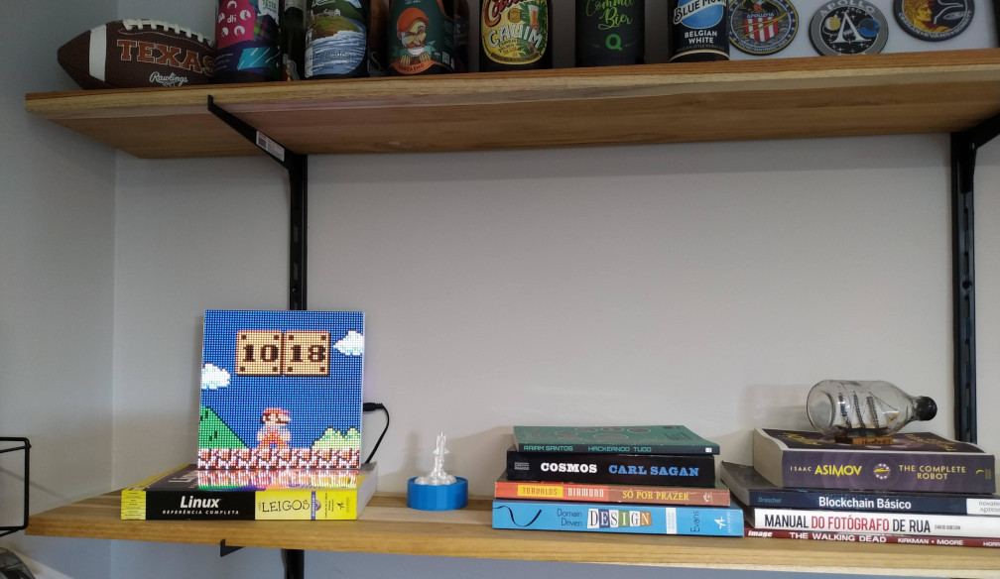

> The [version 1.1.0 was released](https://github.com/jnthas/clockwise/releases/tag/v1.1.0) supporting Improv WiFi and a settings page to set up timezone, RGB/RBG pins, display bright and the 12/24 hours format.

## Flash self-service
Here in this section you can upload the desired clockface to your device. A step-by-step how to flash the Clockwise can be seen [here](https://github.com/jnthas/clockwise/blob/main/README.md#how-to-change-the-clockface-web-flashing). This feature uses the [ESP Web Tools](https://esphome.github.io/esp-web-tools/) library.

<fieldset>
  <legend>📚 Clockface Library</legend>

  

  <label>
    <input type="radio" name="clockface" value="cw-cf-0x01" onclick="handleClick(this);" checked>
    
  </label>
  <label>
    <input type="radio" name="clockface" value="cw-cf-0x02" onclick="handleClick(this);">
    
  </label>
  <label>
    <input type="radio" name="clockface" value="cw-cf-0x03" onclick="handleClick(this);">
    
  </label>
  <label>
    <input type="radio" name="clockface" value="cw-cf-0x04" onclick="handleClick(this);">
    
  </label>
  <label>
    <input type="radio" name="clockface" value="cw-cf-0x05" onclick="handleClick(this);">
    
  </label>
  <label>
    <input type="radio" name="clockface" value="cw-cf-0x06" onclick="handleClick(this);">
    
  </label>
  

</fieldset>

<!-- Flash button -->

  <esp-web-install-button id="esp-web" manifest="">
    <button id="flash-button" slot="activate"></button>
    Ah snap, your browser does not support WebSerial API! If you are using a mobile browser, this is expected. Please, move to the desktop version.
    Ah snap, you are not allowed to use this on HTTP!
  </esp-web-install-button>

## Hardware
You will need only three components to make a Clockwise device, they are easily found on stores like Amazon and Aliexpress. More details [here](https://github.com/jnthas/clockwise/tree/main#driving-the-led-matrix).

## About

Clockwise was an idea I had while working with 64x64 LED matrices. These displays are about the size of a wall clock and with the ESP32, besides controlling the content presented on the display we also gain the functionality of WiFi, Bluetooth, touch buttons and other sensors, which gives us basically a smart wall clock. I wrote a post for [instructables](https://www.instructables.com/Mario-Bros-Clock/).

