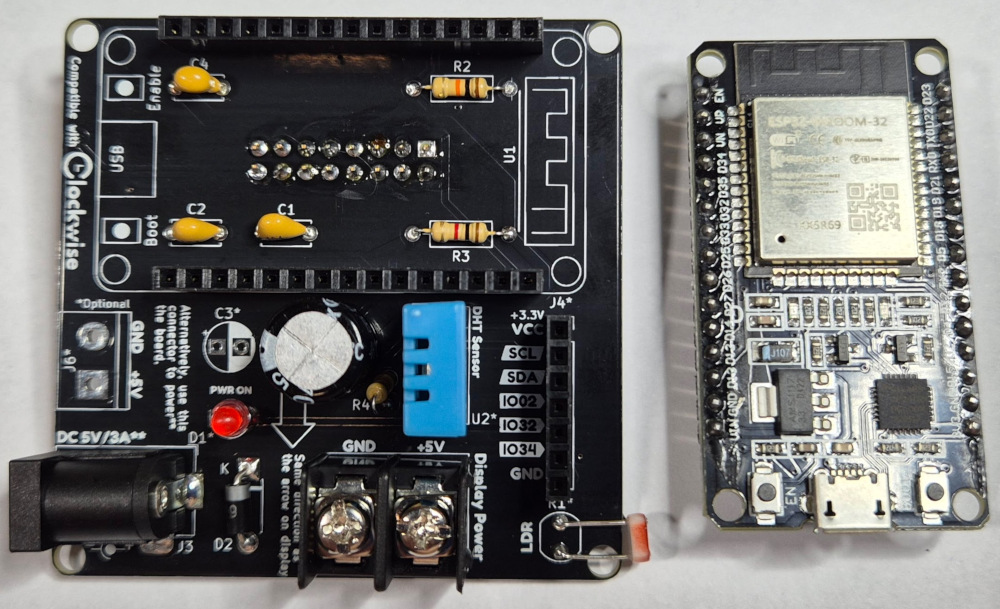

# Hi there! 

If you’re here, it means you’ve decided to build your own Clockwise—thank you for being part of this project! I hope you enjoy every step of the journey, from assembling the PCB to uploading the firmware, and ultimately creating your own custom themes. Have fun and make it yours!

## **What’s in the Box**
Inside your Clockwise DIY Kit, you’ll find everything you need to build your own smart clock:

**Base:**
* RGB LED Matrix 64x64 + Cables
* ESP32 Dev Board
* AC/DC Power Supply 5V 3A
* WiseShield-32 PCB

**Connectors:**
* J1 HUB75 Connector
* J3 Barrel Jack Power Supply Connector
* J5 Terminal Block (Display Power)
* J4 7-pin Female Header - Shield Extension
* U1 ESP32 Female Headers (2x15)

**Discrete Components:**
* C1, C2 Ceramic/Tantalum Capacitor 100nF
* C3 Capacitor 100uF (not included, optional to help stabilize ESP32 voltage input)
* C4 Ceramic/Tantalum Capacitor 1uF
* C5 Electrolytic Capacitor 470uF
* D2 Diode 1N5819
* R2, R3, R4 Resistor 10K

**I/O:**
* U2 DHT11 Sensor
* R1 LDR 5mm A9050
* D1 LED 3mm

## **Before You Start**

Before you begin assembling your Clockwise, make sure you have these tools ready:

* Soldering iron and solder wire
* Wire cutters
* Tweezers
* Multimeter (optional, for testing connections)

**Estimated assembly time:** \~1 hour

**Tips:**

* Work in a well-ventilated space
* Follow ESD precautions
* Always check component orientation before soldering

## **Assembly Instructions**

Follow our [**WiseShield Soldering Guide**](docs/soldering-guide) to assemble your board step-by-step. The guide includes detailed instructions each stage of assembly.

## **First Power-Up & Firmware Flashing**

Once your board is assembled, it’s time to power it up and load the firmware:

1. Connect your Clockwise to your computer using a USB cable.
2. Go to **[https://clockwise.page](https://clockwise.page)**
3. Use the built-in web tool to upload the latest firmware to your device via WebSerial.
4. Select your first theme or use the Canvas Clockface to start creating your own.
5. Follow the on-screen instructions to configure your Wi-Fi.

**Tip:** No special drivers or software needed—everything happens in your browser!

## **Customization & Community**

Want to make your Clockwise your own? The Clockwise community has you covered:

* **ClockClub Gallery**: Browse and download the latest custom clockfaces made by the community.
* **ClockClub**: Learn how to create your own designs using the Canvas Clockface system with a simple JSON description.

Visit the [**ClockClub GitHub Repository**](https://github.com/jnthas/clock-club) to get started.

## **Support & Tutorials**

If you need help, or just want some inspiration:

* [**Video Playlist**](https://www.youtube.com/playlist?list=PL2mlGAhto8F0BKQD4NS-AX1aP_FH7m3mo): Watch videos about Clockwise.
* [**Wiki**](https://github.com/jnthas/clockwise/wiki): Clockwise wiki 
* **Troubleshooting Guide**: Common issues and how to solve them.

## **Get Involved**

Clockwise is an open-source project powered by makers like you.

* Contribute new themes and ideas
* Help improve Clockwise on GitHub